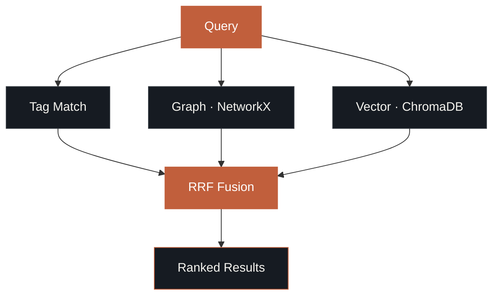

<p align="center">
  <picture>
    <source media="(prefers-color-scheme: dark)" srcset="docs/logo.svg">
    <source media="(prefers-color-scheme: light)" srcset="docs/logo-dark.svg">
    
  </picture>
</p>

<p align="center">
  <em>Zero-config memory for AI agents. No Docker. No API keys. Just install and go.</em>
</p>

<p align="center">
  <a href="https://pypi.org/project/memwright/"></a>
  <a href="https://pypi.org/project/memwright/"></a>
  <a href="https://github.com/bolnet/agent-memory/blob/main/LICENSE"></a>
  <a href="https://registry.modelcontextprotocol.io/servers/io.github.bolnet/memwright"></a>
</p>

---

## Why Memwright?

AI agents forget everything between conversations. Memwright gives them persistent memory with zero setup:

- **Zero config** — `pip install memwright` and go. No Docker, no API keys, no environment variables.
- **Open & inspectable** — Memories live in SQLite + JSON files. Run `sqlite3 memory.db` to see exactly what the agent knows.
- **3-layer retrieval** — Tag matching, NetworkX entity graph, and ChromaDB vector search fused with Reciprocal Rank Fusion.
- **Auto-capture** — Claude Code plugin hooks capture observations automatically. No manual `memory_add` needed.
- **Local embeddings** — sentence-transformers runs on your machine. Nothing leaves your data.

Works as a **Claude Code plugin**, a **Claude Code / Cursor MCP server**, or a **Python library**.

## Install

```bash
pip install memwright
```

That's it. No Docker. No API keys. ChromaDB and NetworkX install as dependencies. Local embeddings download on first use (~90MB, one-time).

## Quick Start — Claude Code Plugin (Recommended)

```
/plugin marketplace add bolnet/agent-memory
```

After install, memories are captured automatically:
- **SessionStart** — injects relevant memories into every session
- **PostToolUse** — captures observations from Write/Edit/Bash
- **Stop** — summarizes key decisions at session end

Skills: `/memwright:mem-recall`, `/memwright:mem-timeline`, `/memwright:mem-health`

## Quick Start — MCP Server (Any Client)

Add to `.mcp.json`:

```json
{
  "mcpServers": {
    "memory": {
      "command": "memwright",
      "args": ["mcp"]
    }
  }
}
```

Restart your editor. You now have 8 memory tools + MCP resources + MCP prompts.

### MCP Tools

| Tool | Description |
|------|-------------|
| `memory_add` | Store a memory with tags, category, entity |
| `memory_get` | Retrieve a specific memory by ID |
| `memory_recall` | Smart multi-layer retrieval with RRF fusion |
| `memory_search` | Filtered search by category, entity, date |
| `memory_forget` | Archive a specific memory |
| `memory_timeline` | Chronological history of an entity |
| `memory_stats` | Store statistics |
| `memory_health` | Component health check |

### MCP Resources & Prompts

- **Resources**: `@memwright:entity://python` — @-mention entities and memories
- **Prompts**: `/mcp__memwright__recall`, `/mcp__memwright__timeline` — native slash commands

## Quick Start — Python Library

```python
from agent_memory import AgentMemory

mem = AgentMemory("./my-agent")  # auto-provisions SQLite + ChromaDB + NetworkX

# Store facts
mem.add("User prefers Python over Java",
        tags=["preference", "coding"], category="preference")
mem.add("User works at Google as Principal Eng",
        tags=["career"], category="career", entity="Google")

# Recall relevant memories (tag + graph + vector fusion)
results = mem.recall("what language does the user prefer?")
for r in results:
    print(f"[{r.match_source}:{r.score:.2f}] {r.memory.content}")

# Get formatted context for prompt injection
context = mem.recall_as_context("user background", budget=20000)

# Contradiction handling — old facts auto-superseded
mem.add("User works at Meta as Director",
        tags=["career"], category="career", entity="Google")
# ^ The Google memory is now superseded automatically
```

## Quick Start — Cursor / Windsurf

Add to `.cursor/mcp.json` (Cursor) or equivalent config:

```json
{
  "mcpServers": {
    "memory": {
      "command": "memwright",
      "args": ["mcp"]
    }
  }
}
```

Same zero-config setup. No environment variables needed.

## Benchmarks

### LOCOMO (Long Conversation Memory)

| System | Accuracy |
|--------|----------|
| MemMachine | 84.9% |
| **Memwright** | **81.2%** |
| Zep | ~75% |
| Letta | 74.0% |
| Mem0 (Graph) | 66.9% |
| OpenAI Memory | 52.9% |

*LOCOMO scores are [disputed across vendors](https://blog.getzep.com/lies-damn-lies-statistics-is-mem0-really-sota-in-agent-memory/). Numbers above are self-reported.*

**How Memwright uses LLMs:** Retrieval is fully local — tag matching, graph traversal, and vector search with RRF fusion. No LLM re-ranking or judge. Embeddings are local (sentence-transformers). Only the benchmark answer synthesis uses an LLM.

## How Retrieval Works

Multi-layer cascade with Reciprocal Rank Fusion:



Entity relationships are traversed to find related memories (e.g., querying "Python" also finds memories about "FastAPI" if they're connected). Graph relationship triples are injected as synthetic context for multi-hop reasoning.

## Architecture

```
AgentMemory
├── SQLite           — Core storage, ACID guarantees
├── ChromaDB         — Semantic vector search (local sentence-transformers)
├── NetworkX         — Entity graph, multi-hop BFS traversal, JSON persistence
├── Retrieval        — 3-layer cascade with RRF fusion
├── Temporal         — Contradiction detection, supersession, validity windows
├── Extraction       — Rule-based + optional LLM
├── Hooks            — SessionStart, PostToolUse, Stop (Claude Code plugin)
├── MCP Server       — 8 tools + resources + prompts
└── CLI + Doctor     — Health check for all components
```

## CLI

```bash
agent-memory add ./store "text" ...    # Add a memory
agent-memory recall ./store "query"    # Multi-layer recall
agent-memory search ./store "text"     # Search memories
agent-memory list ./store              # List memories
agent-memory timeline ./store          # Entity timeline
agent-memory stats ./store             # Store statistics
agent-memory doctor ./store            # Health check
memwright mcp                          # Start MCP server (zero-config)
memwright hook session-start           # Run SessionStart hook
agent-memory export ./store -o bak.json
agent-memory import ./store bak.json
```

## Configuration

AgentMemory stores `config.json` in the memory store directory:

```json
{
  "default_token_budget": 2000,
  "min_results": 3
}
```

Zero config by default. All backends auto-provision on first use.

## License

Apache 2.0

---

<sub>mcp-name: io.github.bolnet/memwright</sub>
